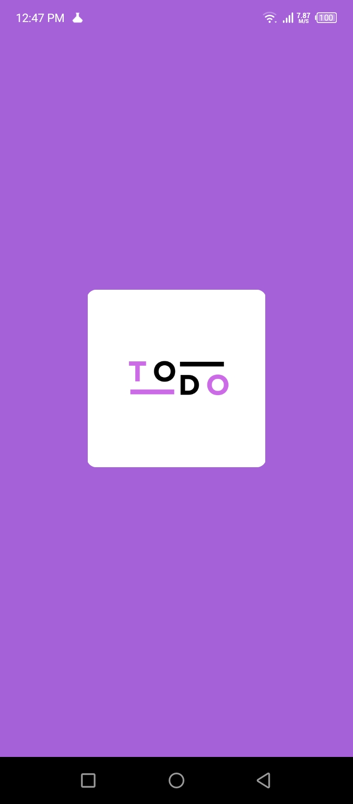
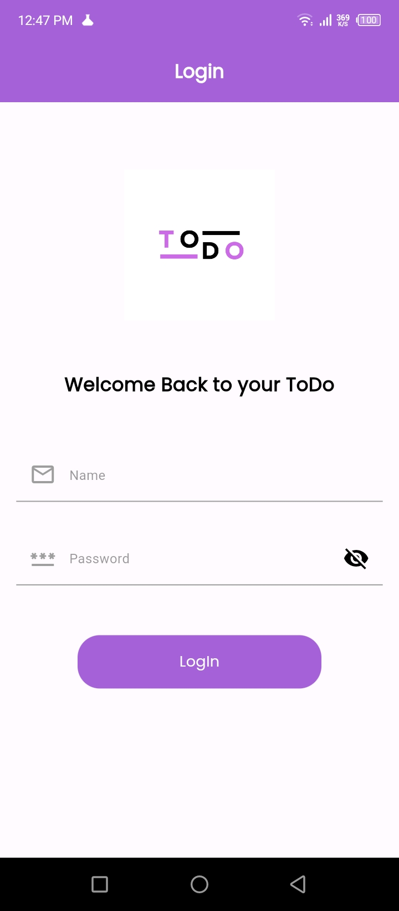
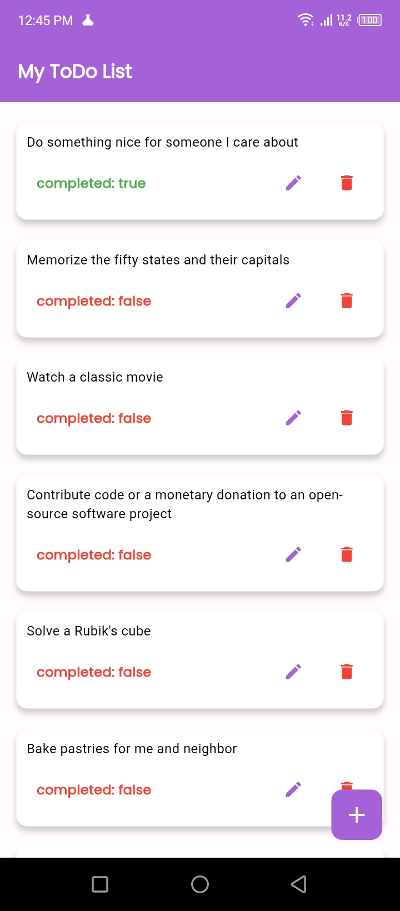
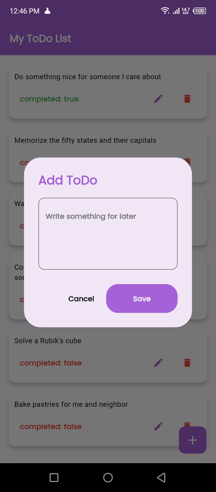
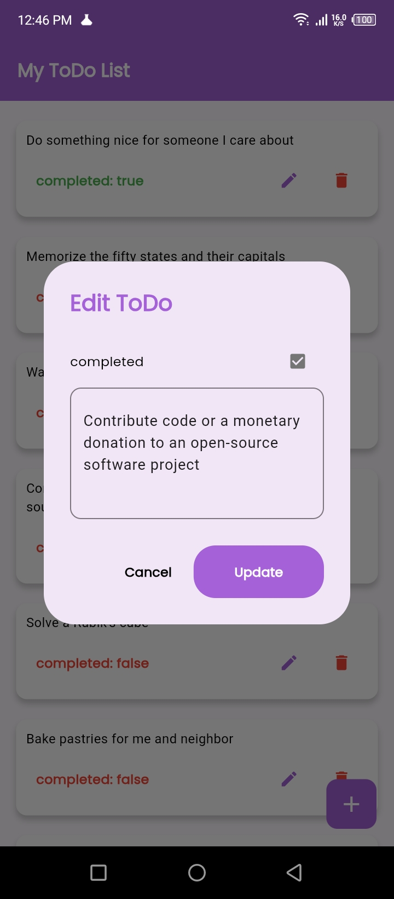
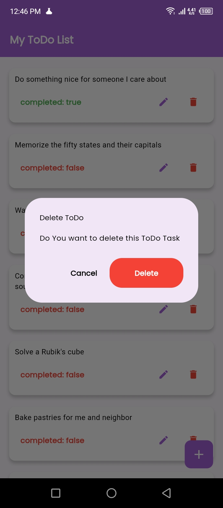

# Todo App

## Description
A simple and intuitive Todo application built with Flutter. This app allows users to manage their tasks efficiently, offering features such as task creation, deletion, and status updates. The app uses Flutter Bloc for state management and integrates with shared preferences for local storage.

## Getting Started

### Prerequisites
To build and run this project, you need the following tools:

- **Flutter SDK**: [Flutter installation guide](https://flutter.dev/docs/get-started/install)
- **Dart SDK** (included with Flutter)
- **IDE**: [Android Studio](https://developer.android.com/studio), [Visual Studio Code](https://code.visualstudio.com/), or any preferred IDE
- **Git**: [Git installation guide](https://git-scm.com/book/en/v2/Getting-Started-Installing-Git)

### Installation
Follow these steps to clone the repository and set up the project locally:

```bash

## Clone the repository
git clone https://github.com/AneebTariq/ToDoList.git

## Navigate to the project directory
cd todo_app

# Get the dependencies
## flutter pub get
## flutter run


# Design Decisions

## Architecture: The app is structured using the MVVM (Model-View-ViewModel) architecture, ensuring a clear separation of concerns.

## State Management: Implemented using flutter_bloc for effective state management.

## UI/UX: Utilizes google_fonts for custom fonts and flutter_screenutil for responsive UI across different screen sizes.

## Permissions: Handled using permission_handler to request necessary permissions from users.


# Challenges Faced

## State Management: Choosing the appropriate state management solution and implementing it effectively with flutter_bloc.

## Local Storage: Integrating shared_preferences to store tasks locally and ensure data persistence.

## Responsive Design: Ensuring the UI scales well on different devices using flutter_screenutil.


# Additional Features

## Custom Fonts: Integrated with google_fonts for a better visual appeal.

## User Notifications: Added toast notifications using fluttertoast to inform users of task actions.

## Dialogues: Used awesome_dialog for improved alert and confirmation dialogs.


# Screenshots













Features:

Backend with API
Scalable
Performance friendly
Home page
Crud ToDoList
Login panel
Easy to edit
Null safety

Login Credentionals

name: kminchelle

Password: 0lelplR